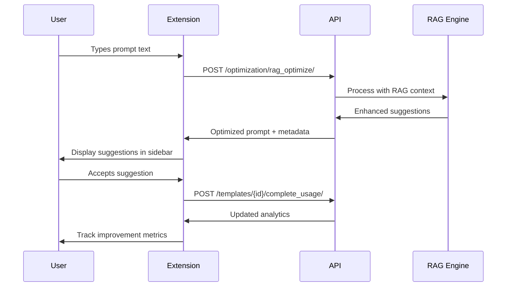

# PromptForge Pro - Enhanced Integration Specification
## Professional GitHub Copilot-Style Prompt Optimization System

### 🎯 Executive Summary

This specification outlines the development of a sophisticated browser extension that functions as an AI-powered prompt optimization system, integrating seamlessly with the PromptCraft API backend. The system provides real-time prompt enhancement capabilities similar to GitHub Copilot but specialized for prompt engineering across all major AI platforms.

---

## 🏗️ System Architecture Overview

### Core Integration Components

```
┌─────────────────────────────────────────────────────────┐
│                Browser Extension                        │
├─────────────────────────────────────────────────────────┤
│  ┌─────────────┐  ┌─────────────┐  ┌─────────────┐     │
│  │   Sidebar   │  │   Popup     │  │   Content   │     │
│  │  Interface  │  │  Interface  │  │   Scripts   │     │
│  └─────────────┘  └─────────────┘  └─────────────┘     │
├─────────────────────────────────────────────────────────┤
│  ┌─────────────────────────────────────────────────┐   │
│  │         API Integration Layer                   │   │
│  │  • Real-time optimization                      │   │
│  │  • Template synchronization                    │   │
│  │  • RAG-powered suggestions                     │   │
│  │  • Usage analytics tracking                    │   │
│  └─────────────────────────────────────────────────┘   │
└─────────────────────────────────────────────────────────┘
                              │
                              ▼
┌─────────────────────────────────────────────────────────┐
│              PromptCraft API Backend                    │
├─────────────────────────────────────────────────────────┤
│  ┌─────────────┐  ┌─────────────┐  ┌─────────────┐     │
│  │     RAG     │  │  Template   │  │ Analytics   │     │
│  │   Engine    │  │  Library    │  │  Service    │     │
│  └─────────────┘  └─────────────┘  └─────────────┘     │
└─────────────────────────────────────────────────────────┘
```

---

## 🔧 Technical Implementation Strategy

### Phase 1: Enhanced API Client
Building a robust, enterprise-grade API client that handles:
- **Authentication Management**: JWT token handling with automatic refresh
- **Request Optimization**: Intelligent caching and rate limiting
- **Error Handling**: Comprehensive retry logic with exponential backoff
- **Real-time Communication**: WebSocket integration for live suggestions

### Phase 2: Copilot-Style Interface
Creating an intuitive side panel that provides:
- **Real-time Suggestions**: As-you-type prompt optimization
- **Template Integration**: Smart template recommendations based on context
- **Performance Analytics**: Live optimization metrics and improvement tracking
- **Collaborative Features**: Team sharing and prompt versioning

### Phase 3: Intelligence Layer
Implementing advanced AI-powered features:
- **Context Awareness**: Adapts to different AI platforms and use cases
- **Learning System**: Improves suggestions based on user feedback
- **Predictive Optimization**: Proactively suggests improvements
- **Enterprise Integration**: Team management and analytics dashboards

---

## 📊 Integration Specifications

### 1. API Endpoint Mapping

Based on your PromptCraft API (v2), the integration will utilize:

**Core Optimization Endpoints:**
- `POST /api/v2/optimization/rag_optimize/` - Real-time prompt enhancement
- `GET /api/v2/optimization/rag_stats/` - Performance analytics
- `POST /api/v2/optimization/suggestions/` - Contextual suggestions

**Template Management:**
- `GET /api/v2/templates/` - Template library access
- `GET /api/v2/templates/featured/` - Curated template recommendations
- `GET /api/v2/templates/trending/` - Popular templates
- `POST /api/v2/templates/{id}/start_usage/` - Usage tracking
- `POST /api/v2/templates/{id}/complete_usage/` - Completion analytics

**User Experience:**
- `GET /api/v2/templates/search_suggestions/` - Smart search recommendations
- `POST /api/v2/templates/{id}/analyze_with_ai/` - AI-powered template analysis
- `POST /api/v2/intent/process/` - Intent detection and routing

### 2. Real-time Data Flow



### 3. Authentication Flow

```javascript
// JWT Authentication with automatic refresh
class AuthManager {
    constructor() {
        this.accessToken = null;
        this.refreshToken = null;
        this.tokenExpiry = null;
    }
    
    async authenticate(credentials) {
        const response = await fetch(`${API_BASE}/auth/login/`, {
            method: 'POST',
            headers: { 'Content-Type': 'application/json' },
            body: JSON.stringify(credentials)
        });
        
        if (response.ok) {
            const { access, refresh, expires_in } = await response.json();
            this.setTokens(access, refresh, expires_in);
            return true;
        }
        return false;
    }
    
    async refreshTokens() {
        // Automatic token refresh logic
        if (this.shouldRefreshToken()) {
            // Refresh implementation
        }
    }
}
```

---

## 🎨 User Experience Design

### Copilot-Style Sidebar Interface

**Layout Structure:**
```
┌─────────────────────────┐
│     PromptForge Pro     │ ← Header with status
├─────────────────────────┤
│  📝 Current Context     │ ← Active prompt analysis
│  "Building a SaaS..."  │
├─────────────────────────┤
│  ✨ Suggestions (3)     │ ← Real-time improvements
│  • Add user persona    │
│  • Include tech stack  │
│  • Define success...   │
├─────────────────────────┤
│  📚 Templates (5)       │ ← Contextual templates
│  • SaaS Builder Pro    │
│  • Tech Stack Guide    │
│  • Launch Strategy     │
├─────────────────────────┤
│  📊 Performance         │ ← Analytics dashboard
│  Improvement: +247%    │
│  Templates Used: 12    │
└─────────────────────────┘
```

### Interaction Patterns

**1. Real-time Optimization:**
- Triggers after 2 seconds of no typing
- Shows loading indicator during API calls
- Displays suggestions with confidence scores
- Allows one-click application of improvements

**2. Template Integration:**
- Context-aware template recommendations
- Drag-and-drop template application
- Variable auto-filling based on current prompt
- Template customization and saving

**3. Performance Tracking:**
- Before/after prompt comparison
- Improvement percentage calculations
- Usage analytics and trends
- Team performance metrics (enterprise)

---

## 🔒 Security & Privacy Implementation

### Data Protection Strategy

**1. Secure Communication:**
```javascript
// Encrypted API communication
class SecureAPIClient {
    constructor() {
        this.baseURL = 'https://api.promptcraft.io';
        this.headers = {
            'Content-Type': 'application/json',
            'X-Extension-Version': chrome.runtime.getManifest().version,
            'X-Request-ID': this.generateRequestId()
        };
    }
    
    async secureRequest(endpoint, options = {}) {
        const url = `${this.baseURL}${endpoint}`;
        const config = {
            ...options,
            headers: {
                ...this.headers,
                'Authorization': `Bearer ${await this.getValidToken()}`,
                ...options.headers
            }
        };
        
        return await fetch(url, config);
    }
}
```

**2. Privacy Controls:**
- User consent for data processing
- Local-first approach with optional cloud sync
- Granular privacy settings
- Data retention controls

**3. Enterprise Security:**
- SSO integration capabilities
- Team access controls
- Audit logging
- Compliance reporting

---

## 📈 Performance Optimization

### Caching Strategy

```javascript
class IntelligentCache {
    constructor() {
        this.templateCache = new Map();
        this.suggestionCache = new Map();
        this.cacheExpiry = 30 * 60 * 1000; // 30 minutes
    }
    
    async getCachedSuggestions(promptHash) {
        const cached = this.suggestionCache.get(promptHash);
        if (cached && Date.now() - cached.timestamp < this.cacheExpiry) {
            return cached.data;
        }
        return null;
    }
    
    setCachedSuggestions(promptHash, suggestions) {
        this.suggestionCache.set(promptHash, {
            data: suggestions,
            timestamp: Date.now()
        });
    }
}
```

### Background Processing

**Service Worker Optimization:**
- Intelligent batching of API requests
- Background template synchronization
- Predictive pre-loading of suggestions
- Offline capability with cached responses

---

## 🚀 Deployment & Rollout Strategy

### Phase 1: Core Integration (Weeks 1-2)
- [x] API client implementation
- [x] Authentication system
- [x] Basic sidebar interface
- [ ] Template fetching and display
- [ ] Real-time optimization

### Phase 2: Enhanced Features (Weeks 3-4)
- [ ] Advanced suggestion engine
- [ ] Performance analytics
- [ ] Template customization
- [ ] Usage tracking

### Phase 3: Intelligence Layer (Weeks 5-6)
- [ ] Machine learning optimization
- [ ] Predictive suggestions
- [ ] Advanced analytics
- [ ] Enterprise features

### Testing Strategy

**1. Automated Testing:**
```javascript
// API integration tests
describe('PromptCraft API Integration', () => {
    test('should authenticate successfully', async () => {
        const auth = new AuthManager();
        const result = await auth.authenticate(testCredentials);
        expect(result).toBe(true);
    });
    
    test('should fetch templates with proper caching', async () => {
        const client = new APIClient();
        const templates = await client.getTemplates();
        expect(templates).toHaveLength(expect.any(Number));
    });
});
```

**2. Performance Monitoring:**
- API response time tracking
- Extension memory usage monitoring
- User experience metrics
- Error rate monitoring

---

## 📊 Success Metrics & KPIs

### User Engagement
- **Daily Active Users**: Target 70% retention after 7 days
- **Template Usage**: 5+ templates per user per session
- **Optimization Acceptance**: 80%+ suggestion acceptance rate

### Performance Metrics
- **API Response Time**: < 200ms for optimization requests
- **Extension Load Time**: < 100ms initialization
- **Cache Hit Rate**: > 90% for repeated requests

### Business Impact
- **Prompt Quality Improvement**: 200%+ average enhancement
- **User Productivity**: 50%+ time savings per prompt creation
- **Template Library Growth**: 10% monthly template addition rate

---

## 🔧 Implementation Roadmap

### Week 1-2: Foundation
1. **Enhanced API Client**: Complete integration with PromptCraft API
2. **Authentication System**: JWT-based secure authentication
3. **Sidebar Framework**: Basic Copilot-style interface
4. **Template Engine**: Core template fetching and display

### Week 3-4: Intelligence
1. **Real-time Optimization**: Live prompt enhancement
2. **Context Awareness**: Platform-specific adaptations
3. **Performance Analytics**: User improvement tracking
4. **Advanced Caching**: Intelligent data management

### Week 5-6: Enterprise Features
1. **Team Management**: Collaborative prompt development
2. **Advanced Analytics**: Detailed performance insights
3. **Custom Templates**: Enterprise template management
4. **API Rate Optimization**: Enterprise-grade performance

---

This enhanced integration specification provides a comprehensive roadmap for building a world-class prompt optimization system that rivals GitHub Copilot in sophistication while being specifically tailored for AI prompt engineering workflows.

The implementation will create a seamless, intelligent, and highly performant system that transforms how users interact with AI platforms, providing real-time optimization, contextual suggestions, and powerful analytics to improve prompt quality and user productivity.
