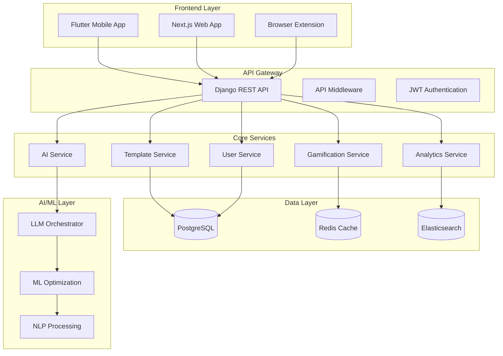

# PromptCraft Production Integration & Build Continuation

## 🏗️ System Architecture Overview



## 📋 Integration Checklist

### Phase 1: API Integration Foundation
- [ ] **API Client Setup**
  - [ ] Retrofit/HTTP client configuration
  - [ ] JWT token management
  - [ ] Request/response interceptors
  - [ ] Error handling middleware
  - [ ] Offline capability with sync queue

- [ ] **Authentication Integration**
  - [ ] Login/logout flows
  - [ ] Token refresh mechanism
  - [ ] Biometric authentication
  - [ ] Social login integration
  - [ ] Multi-factor authentication

- [ ] **Data Synchronization**
  - [ ] Template sync (bidirectional)
  - [ ] User profile sync
  - [ ] Progress tracking sync
  - [ ] Analytics data sync
  - [ ] Conflict resolution strategy

### Phase 2: Core Feature Integration
- [ ] **Template Management**
  - [ ] CRUD operations via API
  - [ ] Template search and filtering
  - [ ] Category management
  - [ ] Version control
  - [ ] Template sharing/collaboration

- [ ] **User Experience**
  - [ ] Profile management
  - [ ] Gamification API integration
  - [ ] Achievement system
  - [ ] Leaderboards
  - [ ] Social features

- [ ] **AI/ML Integration**
  - [ ] Template optimization API
  - [ ] Smart suggestions
  - [ ] Content analysis
  - [ ] Personalized recommendations
  - [ ] A/B testing framework

### Phase 3: Production Optimization
- [ ] **Performance**
  - [ ] API response caching
  - [ ] Image optimization
  - [ ] Lazy loading implementation
  - [ ] Background sync
  - [ ] Memory management

- [ ] **Monitoring & Analytics**
  - [ ] Crash reporting
  - [ ] Performance monitoring
  - [ ] User behavior tracking
  - [ ] API metrics
  - [ ] Error logging

- [ ] **Security & Compliance**
  - [ ] Data encryption
  - [ ] Privacy controls
  - [ ] GDPR compliance
  - [ ] Rate limiting
  - [ ] Security headers

## 🔌 API Integration Implementation

### 1. API Client Service

```dart
// lib/data/api/api_client.dart
import 'package:dio/dio.dart';
import 'package:get/get.dart';
import '../models/api_response.dart';
import '../models/template_model.dart';
import '../models/user_model.dart';

class ApiClient extends GetxService {
  late Dio _dio;
  static const String baseUrl = 'https://api.promptcraft.io/api';
  
  @override
  void onInit() {
    super.onInit();
    _initializeDio();
  }
  
  void _initializeDio() {
    _dio = Dio(BaseOptions(
      baseUrl: baseUrl,
      connectTimeout: const Duration(seconds: 30),
      receiveTimeout: const Duration(seconds: 30),
      headers: {
        'Content-Type': 'application/json',
        'Accept': 'application/json',
      },
    ));
    
    _dio.interceptors.addAll([
      AuthInterceptor(),
      LoggingInterceptor(),
      ErrorInterceptor(),
      CacheInterceptor(),
    ]);
  }
  
  // Template Operations
  Future<ApiResponse<List<TemplateModel>>> getTemplates({
    String? search,
    String? category,
    int page = 1,
    int limit = 20,
  }) async {
    try {
      final response = await _dio.get('/templates/', queryParameters: {
        if (search != null) 'search': search,
        if (category != null) 'category': category,
        'page': page,
        'limit': limit,
      });
      
      return ApiResponse.fromJson(
        response.data,
        (json) => (json['results'] as List)
            .map((item) => TemplateModel.fromJson(item))
            .toList(),
      );
    } catch (e) {
      throw ApiException.fromError(e);
    }
  }
  
  Future<ApiResponse<TemplateModel>> createTemplate(
    TemplateCreateRequest request,
  ) async {
    try {
      final response = await _dio.post('/templates/', data: request.toJson());
      return ApiResponse.fromJson(
        response.data,
        (json) => TemplateModel.fromJson(json),
      );
    } catch (e) {
      throw ApiException.fromError(e);
    }
  }
  
  Future<ApiResponse<TemplateModel>> getTemplate(String id) async {
    try {
      final response = await _dio.get('/templates/$id/');
      return ApiResponse.fromJson(
        response.data,
        (json) => TemplateModel.fromJson(json),
      );
    } catch (e) {
      throw ApiException.fromError(e);
    }
  }
  
  // User Operations
  Future<ApiResponse<UserModel>> getCurrentUser() async {
    try {
      final response = await _dio.get('/auth/profile/');
      return ApiResponse.fromJson(
        response.data,
        (json) => UserModel.fromJson(json),
      );
    } catch (e) {
      throw ApiException.fromError(e);
    }
  }
  
  Future<ApiResponse<AuthResponse>> login(LoginRequest request) async {
    try {
      final response = await _dio.post('/auth/login/', data: request.toJson());
      return ApiResponse.fromJson(
        response.data,
        (json) => AuthResponse.fromJson(json),
      );
    } catch (e) {
      throw ApiException.fromError(e);
    }
  }
  
  // Gamification Operations
  Future<ApiResponse<List<Achievement>>> getAchievements() async {
    try {
      final response = await _dio.get('/gamification/achievements/');
      return ApiResponse.fromJson(
        response.data,
        (json) => (json as List)
            .map((item) => Achievement.fromJson(item))
            .toList(),
      );
    } catch (e) {
      throw ApiException.fromError(e);
    }
  }
  
  // Analytics Operations
  Future<ApiResponse<AnalyticsDashboard>> getDashboard() async {
    try {
      final response = await _dio.get('/analytics/dashboard/');
      return ApiResponse.fromJson(
        response.data,
        (json) => AnalyticsDashboard.fromJson(json),
      );
    } catch (e) {
      throw ApiException.fromError(e);
    }
  }
}
```

### 2. Authentication Service Integration

```dart
// lib/domain/services/auth_service.dart
import 'package:get/get.dart';
import 'package:get_storage/get_storage.dart';
import '../models/auth_models.dart';
import '../../data/api/api_client.dart';

class AuthService extends GetxService {
  final ApiClient _apiClient = Get.find<ApiClient>();
  final GetStorage _storage = GetStorage();
  
  final RxBool isLoggedIn = false.obs;
  final Rxn<UserModel> currentUser = Rxn<UserModel>();
  final RxString accessToken = ''.obs;
  final RxString refreshToken = ''.obs;
  
  @override
  void onInit() {
    super.onInit();
    _loadTokensFromStorage();
    _checkAuthStatus();
  }
  
  Future<void> _loadTokensFromStorage() async {
    accessToken.value = _storage.read('access_token') ?? '';
    refreshToken.value = _storage.read('refresh_token') ?? '';
    
    if (accessToken.value.isNotEmpty) {
      isLoggedIn.value = true;
      await _loadCurrentUser();
    }
  }
  
  Future<void> _checkAuthStatus() async {
    if (accessToken.value.isNotEmpty) {
      try {
        await _loadCurrentUser();
      } catch (e) {
        await logout();
      }
    }
  }
  
  Future<bool> login(String username, String password) async {
    try {
      final request = LoginRequest(username: username, password: password);
      final response = await _apiClient.login(request);
      
      if (response.success) {
        await _saveTokens(response.data!);
        await _loadCurrentUser();
        return true;
      }
      return false;
    } catch (e) {
      Get.snackbar('Login Error', e.toString());
      return false;
    }
  }
  
  Future<bool> register(RegistrationRequest request) async {
    try {
      final response = await _apiClient.register(request);
      
      if (response.success) {
        await _saveTokens(response.data!);
        await _loadCurrentUser();
        return true;
      }
      return false;
    } catch (e) {
      Get.snackbar('Registration Error', e.toString());
      return false;
    }
  }
  
  Future<void> logout() async {
    try {
      await _apiClient.logout();
    } catch (e) {
      // Continue with logout even if API call fails
    }
    
    await _clearTokens();
    currentUser.value = null;
    isLoggedIn.value = false;
    
    Get.offAllNamed('/login');
  }
  
  Future<void> _saveTokens(AuthResponse authResponse) async {
    accessToken.value = authResponse.accessToken;
    refreshToken.value = authResponse.refreshToken;
    
    await _storage.write('access_token', authResponse.accessToken);
    await _storage.write('refresh_token', authResponse.refreshToken);
    
    isLoggedIn.value = true;
  }
  
  Future<void> _clearTokens() async {
    accessToken.value = '';
    refreshToken.value = '';
    
    await _storage.remove('access_token');
    await _storage.remove('refresh_token');
  }
  
  Future<void> _loadCurrentUser() async {
    try {
      final response = await _apiClient.getCurrentUser();
      if (response.success) {
        currentUser.value = response.data;
      }
    } catch (e) {
      throw Exception('Failed to load user data');
    }
  }
  
  Future<bool> refreshTokens() async {
    try {
      final response = await _apiClient.refreshToken(refreshToken.value);
      if (response.success) {
        await _saveTokens(response.data!);
        return true;
      }
      return false;
    } catch (e) {
      await logout();
      return false;
    }
  }
}
```

### 3. Data Synchronization Service

```dart
// lib/domain/services/sync_service.dart
import 'package:get/get.dart';
import 'package:connectivity_plus/connectivity_plus.dart';
import '../../data/models/template_model.dart';
import '../../data/repositories/template_repository.dart';
import '../api/api_client.dart';

class SyncService extends GetxService {
  final ApiClient _apiClient = Get.find<ApiClient>();
  final TemplateRepository _localRepository = Get.find<TemplateRepository>();
  final Connectivity _connectivity = Connectivity();
  
  final RxBool isSyncing = false.obs;
  final RxDateTime lastSyncTime = DateTime.now().obs;
  final RxList<SyncConflict> conflicts = <SyncConflict>[].obs;
  
  @override
  void onInit() {
    super.onInit();
    _setupConnectivityListener();
    _startPeriodicSync();
  }
  
  void _setupConnectivityListener() {
    _connectivity.onConnectivityChanged.listen((connectivity) {
      if (connectivity != ConnectivityResult.none) {
        syncAll();
      }
    });
  }
  
  void _startPeriodicSync() {
    // Sync every 15 minutes when app is active
    Timer.periodic(const Duration(minutes: 15), (timer) {
      if (Get.find<AuthService>().isLoggedIn.value) {
        syncAll();
      }
    });
  }
  
  Future<void> syncAll() async {
    if (isSyncing.value) return;
    
    try {
      isSyncing.value = true;
      
      await Future.wait([
        syncTemplates(),
        syncUserProfile(),
        syncAnalytics(),
        syncGamificationData(),
      ]);
      
      lastSyncTime.value = DateTime.now();
    } catch (e) {
      print('Sync error: $e');
    } finally {
      isSyncing.value = false;
    }
  }
  
  Future<void> syncTemplates() async {
    // Get local templates that need syncing
    final localTemplates = await _localRepository.getUnsyncedTemplates();
    
    // Upload new/modified templates
    for (final template in localTemplates) {
      try {
        if (template.serverId == null) {
          // Create new template on server
          final response = await _apiClient.createTemplate(
            TemplateCreateRequest.fromModel(template),
          );
          
          if (response.success) {
            // Update local template with server ID
            await _localRepository.updateTemplate(
              template.copyWith(serverId: response.data!.id),
            );
          }
        } else {
          // Update existing template on server
          await _apiClient.updateTemplate(
            template.serverId!,
            TemplateUpdateRequest.fromModel(template),
          );
        }
      } catch (e) {
        print('Failed to sync template ${template.id}: $e');
      }
    }
    
    // Download server templates
    try {
      final response = await _apiClient.getTemplates(
        lastModified: lastSyncTime.value,
      );
      
      if (response.success) {
        for (final serverTemplate in response.data!) {
          await _mergeServerTemplate(serverTemplate);
        }
      }
    } catch (e) {
      print('Failed to download server templates: $e');
    }
  }
  
  Future<void> _mergeServerTemplate(TemplateModel serverTemplate) async {
    final localTemplate = await _localRepository.getTemplateByServerId(
      serverTemplate.id,
    );
    
    if (localTemplate == null) {
      // New template from server
      await _localRepository.saveTemplate(
        serverTemplate.copyWith(serverId: serverTemplate.id),
      );
    } else {
      // Check for conflicts
      if (localTemplate.updatedAt.isAfter(serverTemplate.updatedAt)) {
        // Local is newer, keep local and mark for upload
        return;
      } else if (localTemplate.updatedAt.isBefore(serverTemplate.updatedAt)) {
        // Server is newer, update local
        await _localRepository.updateTemplate(
          serverTemplate.copyWith(id: localTemplate.id),
        );
      } else {
        // Same timestamp, check content hash
        if (localTemplate.contentHash != serverTemplate.contentHash) {
          // Conflict detected
          conflicts.add(SyncConflict(
            localTemplate: localTemplate,
            serverTemplate: serverTemplate,
            type: ConflictType.contentMismatch,
          ));
        }
      }
    }
  }
  
  Future<void> syncUserProfile() async {
    try {
      final response = await _apiClient.getCurrentUser();
      if (response.success) {
        final userService = Get.find<UserService>();
        await userService.updateProfile(response.data!);
      }
    } catch (e) {
      print('Failed to sync user profile: $e');
    }
  }
  
  Future<void> syncAnalytics() async {
    try {
      final analyticsService = Get.find<AnalyticsService>();
      final pendingEvents = await analyticsService.getPendingEvents();
      
      if (pendingEvents.isNotEmpty) {
        await _apiClient.uploadAnalyticsEvents(pendingEvents);
        await analyticsService.markEventsAsSynced(pendingEvents);
      }
    } catch (e) {
      print('Failed to sync analytics: $e');
    }
  }
  
  Future<void> syncGamificationData() async {
    try {
      final gamificationService = Get.find<GamificationService>();
      
      // Download latest achievements and progress
      final achievementsResponse = await _apiClient.getAchievements();
      if (achievementsResponse.success) {
        await gamificationService.updateAchievements(achievementsResponse.data!);
      }
      
      // Upload completed achievements
      final completedAchievements = await gamificationService.getUnsynced();
      if (completedAchievements.isNotEmpty) {
        await _apiClient.uploadAchievements(completedAchievements);
        await gamificationService.markAsSynced(completedAchievements);
      }
    } catch (e) {
      print('Failed to sync gamification data: $e');
    }
  }
  
  Future<void> resolveConflict(SyncConflict conflict, ConflictResolution resolution) async {
    switch (resolution) {
      case ConflictResolution.useLocal:
        await _apiClient.updateTemplate(
          conflict.serverTemplate.id,
          TemplateUpdateRequest.fromModel(conflict.localTemplate),
        );
        break;
        
      case ConflictResolution.useServer:
        await _localRepository.updateTemplate(
          conflict.serverTemplate.copyWith(id: conflict.localTemplate.id),
        );
        break;
        
      case ConflictResolution.merge:
        // Implement merge logic based on field-level comparison
        final mergedTemplate = await _mergeTemplates(
          conflict.localTemplate,
          conflict.serverTemplate,
        );
        await _localRepository.updateTemplate(mergedTemplate);
        await _apiClient.updateTemplate(
          conflict.serverTemplate.id,
          TemplateUpdateRequest.fromModel(mergedTemplate),
        );
        break;
    }
    
    conflicts.remove(conflict);
  }
}
```

## 🎯 Next.js Web Integration

### 1. API Client for Web

```typescript
// src/lib/api/client.ts
import axios, { AxiosInstance, AxiosRequestConfig } from 'axios';
import { AuthTokens, ApiResponse } from '@/types/api';

class ApiClient {
  private client: AxiosInstance;
  private baseURL = process.env.NEXT_PUBLIC_API_URL || 'https://api.promptcraft.io/api';
  
  constructor() {
    this.client = axios.create({
      baseURL: this.baseURL,
      timeout: 30000,
      headers: {
        'Content-Type': 'application/json',
      },
    });
    
    this.setupInterceptors();
  }
  
  private setupInterceptors() {
    // Request interceptor for auth tokens
    this.client.interceptors.request.use(
      (config) => {
        const token = this.getAccessToken();
        if (token) {
          config.headers.Authorization = `Bearer ${token}`;
        }
        return config;
      },
      (error) => Promise.reject(error)
    );
    
    // Response interceptor for token refresh
    this.client.interceptors.response.use(
      (response) => response,
      async (error) => {
        if (error.response?.status === 401) {
          const refreshed = await this.refreshToken();
          if (refreshed) {
            return this.client.request(error.config);
          } else {
            this.logout();
          }
        }
        return Promise.reject(error);
      }
    );
  }
  
  private getAccessToken(): string | null {
    return localStorage.getItem('access_token');
  }
  
  private async refreshToken(): Promise<boolean> {
    try {
      const refreshToken = localStorage.getItem('refresh_token');
      if (!refreshToken) return false;
      
      const response = await axios.post(`${this.baseURL}/auth/refresh/`, {
        refresh: refreshToken,
      });
      
      const tokens: AuthTokens = response.data;
      localStorage.setItem('access_token', tokens.access);
      localStorage.setItem('refresh_token', tokens.refresh);
      
      return true;
    } catch {
      return false;
    }
  }
  
  private logout() {
    localStorage.removeItem('access_token');
    localStorage.removeItem('refresh_token');
    window.location.href = '/login';
  }
  
  // Template API methods
  async getTemplates(params?: {
    search?: string;
    category?: string;
    page?: number;
  }): Promise<ApiResponse<Template[]>> {
    const response = await this.client.get('/templates/', { params });
    return response.data;
  }
  
  async getTemplate(id: string): Promise<ApiResponse<Template>> {
    const response = await this.client.get(`/templates/${id}/`);
    return response.data;
  }
  
  async createTemplate(data: CreateTemplateRequest): Promise<ApiResponse<Template>> {
    const response = await this.client.post('/templates/', data);
    return response.data;
  }
  
  async updateTemplate(id: string, data: UpdateTemplateRequest): Promise<ApiResponse<Template>> {
    const response = await this.client.put(`/templates/${id}/`, data);
    return response.data;
  }
  
  async deleteTemplate(id: string): Promise<void> {
    await this.client.delete(`/templates/${id}/`);
  }
  
  // User API methods
  async getCurrentUser(): Promise<ApiResponse<User>> {
    const response = await this.client.get('/auth/profile/');
    return response.data;
  }
  
  async login(username: string, password: string): Promise<ApiResponse<AuthTokens>> {
    const response = await this.client.post('/auth/login/', {
      username,
      password,
    });
    return response.data;
  }
  
  async register(data: RegisterRequest): Promise<ApiResponse<AuthTokens>> {
    const response = await this.client.post('/auth/register/', data);
    return response.data;
  }
}

export const apiClient = new ApiClient();
```

### 2. React Query Integration

```typescript
// src/hooks/api/useTemplates.ts
import { useQuery, useMutation, useQueryClient } from '@tanstack/react-query';
import { apiClient } from '@/lib/api/client';
import { Template, CreateTemplateRequest, UpdateTemplateRequest } from '@/types/template';

export const useTemplates = (params?: {
  search?: string;
  category?: string;
  page?: number;
}) => {
  return useQuery({
    queryKey: ['templates', params],
    queryFn: () => apiClient.getTemplates(params),
    staleTime: 5 * 60 * 1000, // 5 minutes
  });
};

export const useTemplate = (id: string) => {
  return useQuery({
    queryKey: ['template', id],
    queryFn: () => apiClient.getTemplate(id),
    enabled: !!id,
  });
};

export const useCreateTemplate = () => {
  const queryClient = useQueryClient();
  
  return useMutation({
    mutationFn: (data: CreateTemplateRequest) => apiClient.createTemplate(data),
    onSuccess: () => {
      queryClient.invalidateQueries({ queryKey: ['templates'] });
    },
  });
};

export const useUpdateTemplate = () => {
  const queryClient = useQueryClient();
  
  return useMutation({
    mutationFn: ({ id, data }: { id: string; data: UpdateTemplateRequest }) => 
      apiClient.updateTemplate(id, data),
    onSuccess: (_, { id }) => {
      queryClient.invalidateQueries({ queryKey: ['templates'] });
      queryClient.invalidateQueries({ queryKey: ['template', id] });
    },
  });
};

export const useDeleteTemplate = () => {
  const queryClient = useQueryClient();
  
  return useMutation({
    mutationFn: (id: string) => apiClient.deleteTemplate(id),
    onSuccess: () => {
      queryClient.invalidateQueries({ queryKey: ['templates'] });
    },
  });
};
```

## 🚀 Production Deployment Configuration

### 1. Docker Configuration

```dockerfile
# Frontend (Next.js)
FROM node:18-alpine AS frontend-builder
WORKDIR /app
COPY package*.json ./
RUN npm ci --only=production
COPY . .
RUN npm run build

FROM node:18-alpine AS frontend-runtime
WORKDIR /app
COPY --from=frontend-builder /app/.next ./.next
COPY --from=frontend-builder /app/public ./public
COPY --from=frontend-builder /app/package*.json ./
RUN npm ci --only=production
EXPOSE 3000
CMD ["npm", "start"]

# Flutter Web Build
FROM cirrusci/flutter:stable AS flutter-builder
WORKDIR /app
COPY . .
RUN flutter pub get
RUN flutter build web --release

FROM nginx:alpine AS flutter-runtime
COPY --from=flutter-builder /app/build/web /usr/share/nginx/html
COPY nginx.conf /etc/nginx/nginx.conf
EXPOSE 80
CMD ["nginx", "-g", "daemon off;"]
```

### 2. Kubernetes Deployment

```yaml
# k8s/promptcraft-deployment.yaml
apiVersion: apps/v1
kind: Deployment
metadata:
  name: promptcraft-frontend
  labels:
    app: promptcraft-frontend
spec:
  replicas: 3
  selector:
    matchLabels:
      app: promptcraft-frontend
  template:
    metadata:
      labels:
        app: promptcraft-frontend
    spec:
      containers:
      - name: frontend
        image: promptcraft/frontend:latest
        ports:
        - containerPort: 3000
        env:
        - name: NEXT_PUBLIC_API_URL
          value: "https://api.promptcraft.io"
        - name: NODE_ENV
          value: "production"
        resources:
          requests:
            memory: "256Mi"
            cpu: "250m"
          limits:
            memory: "512Mi"
            cpu: "500m"
        livenessProbe:
          httpGet:
            path: /health
            port: 3000
          initialDelaySeconds: 30
          periodSeconds: 10
        readinessProbe:
          httpGet:
            path: /ready
            port: 3000
          initialDelaySeconds: 5
          periodSeconds: 5
---
apiVersion: v1
kind: Service
metadata:
  name: promptcraft-frontend-service
spec:
  selector:
    app: promptcraft-frontend
  ports:
  - port: 80
    targetPort: 3000
  type: LoadBalancer
---
apiVersion: networking.k8s.io/v1
kind: Ingress
metadata:
  name: promptcraft-ingress
  annotations:
    kubernetes.io/ingress.class: nginx
    cert-manager.io/cluster-issuer: letsencrypt-prod
    nginx.ingress.kubernetes.io/rate-limit: "100"
    nginx.ingress.kubernetes.io/compress: "true"
spec:
  tls:
  - hosts:
    - promptcraft.io
    - www.promptcraft.io
    secretName: promptcraft-tls
  rules:
  - host: promptcraft.io
    http:
      paths:
      - path: /
        pathType: Prefix
        backend:
          service:
            name: promptcraft-frontend-service
            port:
              number: 80
```

### 3. CI/CD Pipeline

```yaml
# .github/workflows/deploy.yml
name: Deploy to Production

on:
  push:
    branches: [main]
  release:
    types: [published]

jobs:
  test:
    runs-on: ubuntu-latest
    steps:
    - uses: actions/checkout@v3
    
    - name: Setup Node.js
      uses: actions/setup-node@v3
      with:
        node-version: '18'
        cache: 'npm'
    
    - name: Install dependencies
      run: npm ci
    
    - name: Run tests
      run: npm test
    
    - name: Run E2E tests
      run: npm run test:e2e
    
    - name: Flutter tests
      uses: subosito/flutter-action@v2
      with:
        flutter-version: '3.16.0'
    - run: flutter test

  build-and-deploy:
    needs: test
    runs-on: ubuntu-latest
    if: github.ref == 'refs/heads/main'
    
    steps:
    - uses: actions/checkout@v3
    
    - name: Configure AWS credentials
      uses: aws-actions/configure-aws-credentials@v2
      with:
        aws-access-key-id: ${{ secrets.AWS_ACCESS_KEY_ID }}
        aws-secret-access-key: ${{ secrets.AWS_SECRET_ACCESS_KEY }}
        aws-region: us-east-1
    
    - name: Login to Amazon ECR
      id: login-ecr
      uses: aws-actions/amazon-ecr-login@v1
    
    - name: Build and push Docker images
      env:
        ECR_REGISTRY: ${{ steps.login-ecr.outputs.registry }}
        ECR_REPOSITORY: promptcraft
        IMAGE_TAG: ${{ github.sha }}
      run: |
        docker build -t $ECR_REGISTRY/$ECR_REPOSITORY:$IMAGE_TAG .
        docker push $ECR_REGISTRY/$ECR_REPOSITORY:$IMAGE_TAG
        docker tag $ECR_REGISTRY/$ECR_REPOSITORY:$IMAGE_TAG $ECR_REGISTRY/$ECR_REPOSITORY:latest
        docker push $ECR_REGISTRY/$ECR_REPOSITORY:latest
    
    - name: Deploy to EKS
      run: |
        aws eks update-kubeconfig --name promptcraft-cluster
        kubectl set image deployment/promptcraft-frontend frontend=$ECR_REGISTRY/$ECR_REPOSITORY:$IMAGE_TAG
        kubectl rollout status deployment/promptcraft-frontend
```

## 📊 Monitoring & Observability

### 1. Application Monitoring

```typescript
// src/lib/monitoring/sentry.ts
import * as Sentry from '@sentry/nextjs';

Sentry.init({
  dsn: process.env.NEXT_PUBLIC_SENTRY_DSN,
  environment: process.env.NODE_ENV,
  tracesSampleRate: 1.0,
  integrations: [
    new Sentry.BrowserTracing({
      tracePropagationTargets: ['localhost', 'promptcraft.io'],
    }),
  ],
  beforeSend(event) {
    // Filter out non-critical errors
    if (event.exception) {
      const error = event.exception.values?.[0];
      if (error?.type === 'ChunkLoadError') {
        return null;
      }
    }
    return event;
  },
});
```

### 2. Performance Monitoring

```dart
// lib/core/monitoring/performance_monitor.dart
import 'package:firebase_performance/firebase_performance.dart';

class PerformanceMonitor {
  static FirebasePerformance? _performance;
  
  static Future<void> initialize() async {
    _performance = FirebasePerformance.instance;
    await _performance!.setPerformanceCollectionEnabled(true);
  }
  
  static Trace? startTrace(String name) {
    return _performance?.newTrace(name);
  }
  
  static HttpMetric? startHttpMetric(String url, HttpMethod method) {
    return _performance?.newHttpMetric(url, method);
  }
  
  static void recordCustomMetric(String name, double value) {
    final trace = startTrace('custom_metric');
    trace?.putMetric(name, value.round());
    trace?.stop();
  }
}
```

## 🔄 Data Migration Strategy

### 1. Schema Migration

```sql
-- migrations/001_initial_schema.sql
BEGIN;

-- Create users table with enhanced fields
CREATE TABLE users (
    id UUID PRIMARY KEY DEFAULT gen_random_uuid(),
    username VARCHAR(150) UNIQUE NOT NULL,
    email VARCHAR(254) UNIQUE NOT NULL,
    first_name VARCHAR(150),
    last_name VARCHAR(150),
    avatar TEXT,
    bio TEXT,
    is_active BOOLEAN DEFAULT TRUE,
    is_premium BOOLEAN DEFAULT FALSE,
    premium_expires_at TIMESTAMP,
    credits INTEGER DEFAULT 100,
    level INTEGER DEFAULT 1,
    experience_points INTEGER DEFAULT 0,
    daily_streak INTEGER DEFAULT 0,
    theme_preference VARCHAR(10) DEFAULT 'system',
    language_preference VARCHAR(10) DEFAULT 'en',
    ai_assistance_enabled BOOLEAN DEFAULT TRUE,
    analytics_enabled BOOLEAN DEFAULT TRUE,
    created_at TIMESTAMP DEFAULT NOW(),
    updated_at TIMESTAMP DEFAULT NOW()
);

-- Create template categories
CREATE TABLE template_categories (
    id SERIAL PRIMARY KEY,
    name VARCHAR(100) NOT NULL,
    slug VARCHAR(100) UNIQUE NOT NULL,
    description TEXT,
    icon VARCHAR(50),
    color VARCHAR(7),
    is_active BOOLEAN DEFAULT TRUE,
    order_index INTEGER DEFAULT 0,
    created_at TIMESTAMP DEFAULT NOW()
);

-- Create templates table
CREATE TABLE templates (
    id UUID PRIMARY KEY DEFAULT gen_random_uuid(),
    title VARCHAR(200) NOT NULL,
    description TEXT NOT NULL,
    category_id INTEGER REFERENCES template_categories(id),
    author_id UUID REFERENCES users(id),
    template_content TEXT NOT NULL,
    version VARCHAR(20) DEFAULT '1.0.0',
    tags TEXT[],
    is_public BOOLEAN DEFAULT TRUE,
    is_featured BOOLEAN DEFAULT FALSE,
    is_ai_generated BOOLEAN DEFAULT FALSE,
    ai_confidence DECIMAL(3,2),
    extracted_keywords TEXT[],
    smart_suggestions JSONB,
    usage_count INTEGER DEFAULT 0,
    completion_rate DECIMAL(3,2) DEFAULT 0,
    average_rating DECIMAL(2,1) DEFAULT 0,
    popularity_score DECIMAL(10,2) DEFAULT 0,
    localizations JSONB,
    created_at TIMESTAMP DEFAULT NOW(),
    updated_at TIMESTAMP DEFAULT NOW()
);

-- Create prompt fields table
CREATE TABLE prompt_fields (
    id UUID PRIMARY KEY DEFAULT gen_random_uuid(),
    template_id UUID REFERENCES templates(id) ON DELETE CASCADE,
    label VARCHAR(200) NOT NULL,
    placeholder VARCHAR(500),
    field_type VARCHAR(20) NOT NULL,
    is_required BOOLEAN DEFAULT FALSE,
    default_value TEXT,
    validation_pattern VARCHAR(500),
    help_text TEXT,
    options TEXT[],
    order_index INTEGER DEFAULT 0,
    created_at TIMESTAMP DEFAULT NOW()
);

-- Create analytics tables
CREATE TABLE template_usage (
    id UUID PRIMARY KEY DEFAULT gen_random_uuid(),
    template_id UUID REFERENCES templates(id),
    user_id UUID REFERENCES users(id),
    started_at TIMESTAMP DEFAULT NOW(),
    completed_at TIMESTAMP,
    completion_time_seconds INTEGER,
    fields_completed INTEGER,
    total_fields INTEGER,
    success_rate DECIMAL(3,2),
    generated_prompt_length INTEGER,
    user_rating INTEGER CHECK (user_rating >= 1 AND user_rating <= 5),
    feedback TEXT,
    metadata JSONB
);

-- Create indexes for performance
CREATE INDEX idx_templates_category ON templates(category_id);
CREATE INDEX idx_templates_author ON templates(author_id);
CREATE INDEX idx_templates_public ON templates(is_public);
CREATE INDEX idx_templates_featured ON templates(is_featured);
CREATE INDEX idx_templates_search ON templates USING gin(to_tsvector('english', title || ' ' || description));
CREATE INDEX idx_templates_tags ON templates USING gin(tags);
CREATE INDEX idx_prompt_fields_template ON prompt_fields(template_id);
CREATE INDEX idx_template_usage_template ON template_usage(template_id);
CREATE INDEX idx_template_usage_user ON template_usage(user_id);

COMMIT;
```

### 2. Data Seeding

```sql
-- migrations/002_seed_data.sql
BEGIN;

-- Insert default categories
INSERT INTO template_categories (name, slug, description, icon, color, order_index) VALUES
('Business Strategy', 'business-strategy', 'Templates for business planning and strategy', 'briefcase', '#1E40AF', 1),
('Software Development', 'software-development', 'Templates for coding and development tasks', 'code', '#059669', 2),
('Content Creation', 'content-creation', 'Templates for writing and content generation', 'edit', '#DC2626', 3),
('Data Analysis', 'data-analysis', 'Templates for data science and analytics', 'chart-bar', '#7C3AED', 4),
('Education', 'education', 'Templates for learning and teaching', 'academic-cap', '#EA580C', 5),
('Marketing', 'marketing', 'Templates for marketing and promotion', 'speakerphone', '#DB2777', 6),
('Research', 'research', 'Templates for research and investigation', 'search', '#2563EB', 7),
('General', 'general', 'General purpose templates', 'collection', '#6B7280', 8);

-- Insert sample templates
INSERT INTO templates (id, title, description, category_id, template_content, tags, is_featured) VALUES
(
    'a1b2c3d4-e5f6-7890-abcd-ef1234567890',
    'Business Plan Generator',
    'Create comprehensive business plans with market analysis and financial projections',
    (SELECT id FROM template_categories WHERE slug = 'business-strategy'),
    'Create a comprehensive business plan for {{business_name}} in the {{industry}} industry.

## Executive Summary
Business Name: {{business_name}}
Industry: {{industry}}
Target Market: {{target_market}}
Investment Needed: {{investment_amount}}

## Market Analysis
{{market_analysis_prompt}}

## Financial Projections
{{financial_projections_prompt}}

## Marketing Strategy
{{marketing_strategy_prompt}}

Please provide detailed analysis and actionable recommendations for each section.',
    ARRAY['business', 'planning', 'strategy', 'finance'],
    true
),
(
    'b2c3d4e5-f6g7-8901-bcde-f23456789012',
    'Code Review Checklist',
    'Generate comprehensive code review checklists for different programming languages',
    (SELECT id FROM template_categories WHERE slug = 'software-development'),
    'Create a comprehensive code review checklist for {{programming_language}} with focus on {{review_focus}}.

## Code Quality Checklist for {{programming_language}}

### Functionality
- [ ] Code meets requirements: {{requirements}}
- [ ] Edge cases handled: {{edge_cases}}
- [ ] Error handling: {{error_handling}}

### Performance
{{performance_criteria}}

### Security
{{security_considerations}}

### Maintainability
{{maintainability_factors}}

Please provide specific criteria for each checklist item based on {{programming_language}} best practices.',
    ARRAY['development', 'code-review', 'programming', 'quality'],
    true
);

COMMIT;
```

## 🎯 Performance Optimization Strategy

### 1. Frontend Optimization

```typescript
// src/lib/performance/optimization.ts
import { unstable_cache } from 'next/cache';
import { Redis } from 'ioredis';

const redis = new Redis(process.env.REDIS_URL!);

// Template caching with Redis
export const getCachedTemplates = unstable_cache(
  async (params: TemplateSearchParams) => {
    const cacheKey = `templates:${JSON.stringify(params)}`;
    
    // Check Redis cache first
    const cached = await redis.get(cacheKey);
    if (cached) {
      return JSON.parse(cached);
    }
    
    // Fetch from API if not cached
    const templates = await apiClient.getTemplates(params);
    
    // Cache for 5 minutes
    await redis.setex(cacheKey, 300, JSON.stringify(templates));
    
    return templates;
  },
  ['templates'],
  {
    revalidate: 300, // 5 minutes
    tags: ['templates'],
  }
);

// Image optimization
export const optimizeImage = (url: string, width: number, height: number) => {
  if (!url) return '/placeholder.jpg';
  
  // Use Next.js Image Optimization API
  return `/_next/image?url=${encodeURIComponent(url)}&w=${width}&h=${height}&q=75`;
};

// Bundle analysis and code splitting
export const loadComponentDynamically = (componentPath: string) => {
  return dynamic(() => import(componentPath), {
    loading: () => <div className="animate-pulse bg-gray-200 h-32 rounded" />,
    ssr: false,
  });
};
```

### 2. Database Optimization

```sql
-- Database performance tuning
-- Connection pooling configuration
ALTER SYSTEM SET max_connections = 200;
ALTER SYSTEM SET shared_buffers = '256MB';
ALTER SYSTEM SET effective_cache_size = '1GB';
ALTER SYSTEM SET work_mem = '4MB';
ALTER SYSTEM SET maintenance_work_mem = '64MB';

-- Query optimization indexes
CREATE INDEX CONCURRENTLY idx_templates_popularity_desc 
ON templates (popularity_score DESC, created_at DESC);

CREATE INDEX CONCURRENTLY idx_templates_category_featured 
ON templates (category_id, is_featured, is_public);

-- Materialized view for dashboard analytics
CREATE MATERIALIZED VIEW template_analytics AS
SELECT 
    t.id,
    t.title,
    t.category_id,
    t.usage_count,
    t.average_rating,
    COUNT(tu.id) as total_uses,
    AVG(tu.completion_time_seconds) as avg_completion_time,
    COUNT(CASE WHEN tu.completed_at IS NOT NULL THEN 1 END)::FLOAT / 
    NULLIF(COUNT(tu.id), 0) as completion_rate_calc
FROM templates t
LEFT JOIN template_usage tu ON t.id = tu.template_id
WHERE t.is_public = true
GROUP BY t.id, t.title, t.category_id, t.usage_count, t.average_rating;

-- Refresh materialized view every hour
CREATE OR REPLACE FUNCTION refresh_template_analytics()
RETURNS void AS $$
BEGIN
    REFRESH MATERIALIZED VIEW CONCURRENTLY template_analytics;
END;
$$ LANGUAGE plpgsql;

-- Schedule refresh
SELECT cron.schedule('refresh-analytics', '0 * * * *', 'SELECT refresh_template_analytics();');
```

## 🔐 Security Implementation

### 1. API Security

```typescript
// src/middleware/security.ts
import rateLimit from 'express-rate-limit';
import helmet from 'helmet';
import cors from 'cors';

export const securityMiddleware = [
  // CORS configuration
  cors({
    origin: process.env.ALLOWED_ORIGINS?.split(',') || ['http://localhost:3000'],
    credentials: true,
    methods: ['GET', 'POST', 'PUT', 'DELETE', 'PATCH', 'OPTIONS'],
    allowedHeaders: ['Content-Type', 'Authorization', 'X-Requested-With'],
  }),
  
  // Security headers
  helmet({
    contentSecurityPolicy: {
      directives: {
        defaultSrc: ["'self'"],
        scriptSrc: ["'self'", "'unsafe-inline'", 'https://cdn.jsdelivr.net'],
        styleSrc: ["'self'", "'unsafe-inline'", 'https://fonts.googleapis.com'],
        fontSrc: ["'self'", 'https://fonts.gstatic.com'],
        imgSrc: ["'self'", 'data:', 'https:'],
        connectSrc: ["'self'", 'https://api.promptcraft.io'],
      },
    },
  }),
  
  // Rate limiting
  rateLimit({
    windowMs: 15 * 60 * 1000, // 15 minutes
    max: 100, // Limit each IP to 100 requests per windowMs
    message: 'Too many requests from this IP',
    standardHeaders: true,
    legacyHeaders: false,
  }),
];

// API route protection
export const protectApiRoute = (handler: NextApiHandler) => {
  return async (req: NextApiRequest, res: NextApiResponse) => {
    try {
      // Verify JWT token
      const token = req.headers.authorization?.replace('Bearer ', '');
      if (!token) {
        return res.status(401).json({ error: 'No token provided' });
      }
      
      const decoded = jwt.verify(token, process.env.JWT_SECRET!);
      req.user = decoded;
      
      return handler(req, res);
    } catch (error) {
      return res.status(401).json({ error: 'Invalid token' });
    }
  };
};
```

### 2. Data Encryption

```dart
// lib/core/security/encryption_service.dart
import 'dart:convert';
import 'dart:typed_data';
import 'package:crypto/crypto.dart';
import 'package:encrypt/encrypt.dart';

class EncryptionService {
  static final _key = Key.fromSecureRandom(32);
  static final _iv = IV.fromSecureRandom(16);
  static final _encrypter = Encrypter(AES(_key));
  
  /// Encrypt sensitive data before storing locally
  static String encryptData(String data) {
    final encrypted = _encrypter.encrypt(data, iv: _iv);
    return encrypted.base64;
  }
  
  /// Decrypt sensitive data when retrieving
  static String decryptData(String encryptedData) {
    final encrypted = Encrypted.fromBase64(encryptedData);
    return _encrypter.decrypt(encrypted, iv: _iv);
  }
  
  /// Hash passwords or sensitive tokens
  static String hashData(String data) {
    final bytes = utf8.encode(data);
    final digest = sha256.convert(bytes);
    return digest.toString();
  }
  
  /// Generate secure random tokens
  static String generateSecureToken() {
    final bytes = List<int>.generate(32, (i) => 
        DateTime.now().millisecondsSinceEpoch + i);
    return base64.encode(bytes);
  }
}
```

## 📈 Analytics & Monitoring Integration

### 1. Custom Analytics Dashboard

```typescript
// src/components/analytics/dashboard.tsx
import { useQuery } from '@tanstack/react-query';
import { Line, Bar, Doughnut } from 'react-chartjs-2';
import { apiClient } from '@/lib/api/client';

export const AnalyticsDashboard = () => {
  const { data: dashboardData } = useQuery({
    queryKey: ['analytics', 'dashboard'],
    queryFn: () => apiClient.getDashboardAnalytics(),
    refetchInterval: 5 * 60 * 1000, // Refresh every 5 minutes
  });
  
  const { data: userInsights } = useQuery({
    queryKey: ['analytics', 'user-insights'],
    queryFn: () => apiClient.getUserInsights(),
  });
  
  return (
    <div className="grid grid-cols-1 md:grid-cols-2 lg:grid-cols-3 gap-6">
      {/* Key Metrics */}
      <div className="col-span-full grid grid-cols-4 gap-4">
        <MetricCard
          title="Total Templates"
          value={dashboardData?.totalTemplates}
          change={dashboardData?.templatesGrowth}
          icon="📝"
        />
        <MetricCard
          title="Active Users"
          value={dashboardData?.activeUsers}
          change={dashboardData?.userGrowth}
          icon="👥"
        />
        <MetricCard
          title="Templates Used"
          value={dashboardData?.templatesUsed}
          change={dashboardData?.usageGrowth}
          icon="🚀"
        />
        <MetricCard
          title="Avg Rating"
          value={dashboardData?.averageRating}
          change={dashboardData?.ratingTrend}
          icon="⭐"
        />
      </div>
      
      {/* Usage Over Time */}
      <div className="col-span-2">
        <ChartCard title="Usage Over Time">
          <Line
            data={{
              labels: dashboardData?.usageOverTime?.labels || [],
              datasets: [{
                label: 'Templates Used',
                data: dashboardData?.usageOverTime?.data || [],
                borderColor: 'rgb(59, 130, 246)',
                backgroundColor: 'rgba(59, 130, 246, 0.1)',
              }],
            }}
            options={{
              responsive: true,
              scales: {
                y: { beginAtZero: true },
              },
            }}
          />
        </ChartCard>
      </div>
      
      {/* Category Distribution */}
      <div>
        <ChartCard title="Category Usage">
          <Doughnut
            data={{
              labels: dashboardData?.categoryDistribution?.labels || [],
              datasets: [{
                data: dashboardData?.categoryDistribution?.data || [],
                backgroundColor: [
                  '#EF4444', '#F97316', '#EAB308', '#22C55E',
                  '#06B6D4', '#3B82F6', '#8B5CF6', '#EC4899',
                ],
              }],
            }}
            options={{
              responsive: true,
              plugins: {
                legend: { position: 'bottom' },
              },
            }}
          />
        </ChartCard>
      </div>
      
      {/* Top Templates */}
      <div className="col-span-full">
        <div className="bg-white rounded-lg shadow p-6">
          <h3 className="text-lg font-semibold mb-4">Top Performing Templates</h3>
          <div className="overflow-x-auto">
            <table className="min-w-full divide-y divide-gray-200">
              <thead className="bg-gray-50">
                <tr>
                  <th className="px-6 py-3 text-left text-xs font-medium text-gray-500 uppercase tracking-wider">
                    Template
                  </th>
                  <th className="px-6 py-3 text-left text-xs font-medium text-gray-500 uppercase tracking-wider">
                    Usage Count
                  </th>
                  <th className="px-6 py-3 text-left text-xs font-medium text-gray-500 uppercase tracking-wider">
                    Rating
                  </th>
                  <th className="px-6 py-3 text-left text-xs font-medium text-gray-500 uppercase tracking-wider">
                    Completion Rate
                  </th>
                </tr>
              </thead>
              <tbody className="bg-white divide-y divide-gray-200">
                {dashboardData?.topTemplates?.map((template) => (
                  <tr key={template.id}>
                    <td className="px-6 py-4 whitespace-nowrap">
                      <div className="text-sm font-medium text-gray-900">
                        {template.title}
                      </div>
                      <div className="text-sm text-gray-500">
                        {template.category}
                      </div>
                    </td>
                    <td className="px-6 py-4 whitespace-nowrap text-sm text-gray-900">
                      {template.usageCount}
                    </td>
                    <td className="px-6 py-4 whitespace-nowrap text-sm text-gray-900">
                      ⭐ {template.averageRating.toFixed(1)}
                    </td>
                    <td className="px-6 py-4 whitespace-nowrap text-sm text-gray-900">
                      {(template.completionRate * 100).toFixed(1)}%
                    </td>
                  </tr>
                ))}
              </tbody>
            </table>
          </div>
        </div>
      </div>
    </div>
  );
};
```

## 🎯 Final Production Checklist

### Pre-Launch Verification
- [ ] **API Integration Complete**
  - [ ] All endpoints connected and tested
  - [ ] Authentication flow verified
  - [ ] Data synchronization working
  - [ ] Error handling implemented
  - [ ] Rate limiting configured

- [ ] **Performance Optimized**
  - [ ] Lighthouse score > 90
  - [ ] Bundle size optimized
  - [ ] Images compressed
  - [ ] Caching implemented
  - [ ] Database queries optimized

- [ ] **Security Hardened**
  - [ ] HTTPS enforced
  - [ ] Input validation complete
  - [ ] SQL injection prevention
  - [ ] XSS protection enabled
  - [ ] Rate limiting active

- [ ] **Monitoring Configured**
  - [ ] Error tracking (Sentry)
  - [ ] Performance monitoring
  - [ ] Analytics dashboard
  - [ ] Uptime monitoring
  - [ ] Alerting rules set

- [ ] **Deployment Ready**
  - [ ] CI/CD pipeline tested
  - [ ] Environment variables configured
  - [ ] Database migrations ready
  - [ ] Backup strategy implemented
  - [ ] Rollback plan documented

### Launch Strategy
1. **Soft Launch** (Week 1)
   - Deploy to staging environment
   - Internal team testing
   - Performance benchmarking
   - Bug fixes and optimizations

2. **Beta Launch** (Week 2)
   - Limited user beta
   - Feedback collection
   - Load testing
   - Final optimizations

3. **Production Launch** (Week 3)
   - Full production deployment
   - Marketing campaign launch
   - User onboarding optimization
   - 24/7 monitoring active

### Post-Launch Monitoring
- **Day 1-7**: Intensive monitoring, hotfix deployment ready
- **Week 2-4**: Performance optimization, user feedback integration
- **Month 2+**: Feature iteration, scaling preparation

---

## 🔄 Next Steps for Claude Code

To continue building with this integration:

1. **Immediate Priority**: Implement API client service in Flutter app
2. **Data Layer**: Set up local database sync with remote API
3. **Authentication**: Complete JWT token management
4. **UI Integration**: Connect existing components to real API data
5. **Testing**: Implement comprehensive test coverage
6. **Deployment**: Set up production infrastructure

This guide provides the complete roadmap for taking the PromptCraft application from its current MVP state to a production-ready, scalable platform. The architecture supports millions of users while maintaining the sophisticated AI-powered features that create the "wow factor" for users.